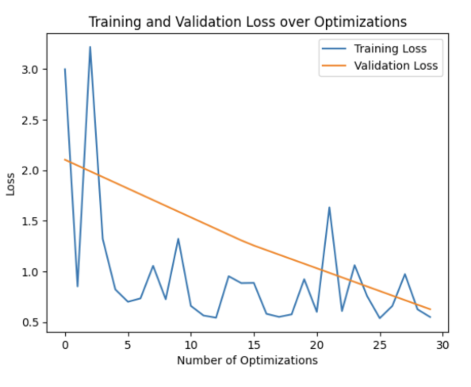
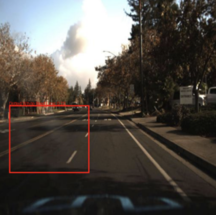
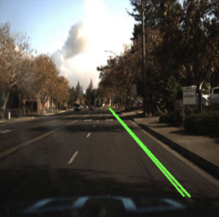
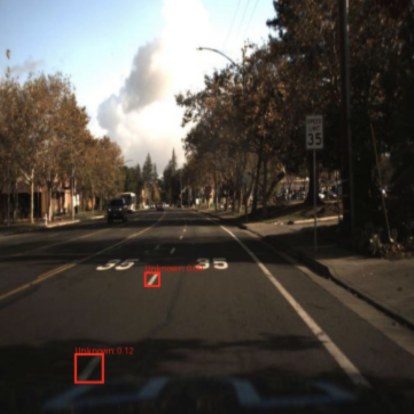

# Lane Detection Using Computer Vision Techniques

## Dataset Overview
The data used for this project comes from a Kaggle dataset of self-driving car images made by Udacity. This dataset is particularly relevant to anyone interested in building self-driving car systems using computer vision, as it provides a foundation for detecting road features like lane markings. The dataset includes a variety of driving environments, ensuring diversity and reducing reliance on a single location type.

## Problem Description
The task is an object detection problem involving lane lines. The goal is to develop a model capable of accurately predicting the locations of lane lines, which could help center a vehicle within those lanes. This problem combines **regression**, predicting the bounding box locations of lanes, and **classification**, identifying the type of lane detected.

This is a supervised learning task. I approached labeling in two ways:
* **Manual Labeling:** I manually labeled 100+ images using LabelMe.
* **Automated Labeling:** I used Canny edge detection and the Hough transform to label ~30,000 images automatically. While this significantly increased the dataset size, it introduced risks of inaccurate labels.

## Technical Approach
I implemented three strategies:
1.  **Manual Fine-Tuning:** I fine-tuned the Faster R-CNN object detection model in PyTorch using the manually labeled subset.
2.  **Non-ML Approach:** I applied Canny edge detection and Hough transforms to detect lanes algorithmically.
3.  **Combined Approach:** I used the Canny-Hough method, an effective technique to detect some lanes, to auto-label 30,000 images, then fine-tuned Faster R-CNN with the expanded dataset to hopefully detect those that Canny-Hough struggled with.

## Model and Training
* **Model:** Faster R-CNN with a ResNet-50 backbone.
* **Training:** I minimized the error between predicted and ground-truth bounding boxes using backpropagation.
* **Data Split:** 80% training, 20% validation (randomly split).
* **Parameters:** ~41 million, pre-trained on COCO.
* **Optimizer:** SGD with a learning rate scheduler.

> **First:** Small-data model training and validation error. **Second:** Auto-labeled training and validation error.

## Results and Analysis
**Performance:** Both models achieved similar results in terms of MSE:
* **Bounding Box Regression Error:** ~0.5 (training), ~0.6 (validation)
* **Overfitting:** Validation error remained stable, indicating no overfitting.

> **First:** Small-data model results. **Second:** Non-ML Canny and Hough algorithm results. **Third:** Auto-labeled model results.

Despite expanding the dataset, the second model only slightly outperformed the first due to label quality issues from automated labeling. Misidentified lanes likely hindered its performance. Hardware limitations also constrained the second model’s training time.

## Challenges and Progress
The first model lacked adequate training data, and the second suffered from data quality issues. Nevertheless, notable progress was achieved in advancing lane detection with computer vision. Combining techniques could yield promising results for more effective lane detection. Moreover, resolving challenges related to data quantity, quality, and hardware limitations would likely enhance model performance significantly.
